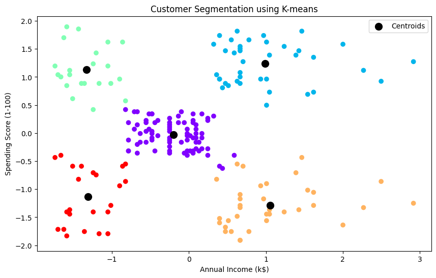

# Customer Segmentation using K-means Clustering

This Python script performs customer segmentation using the K-means clustering algorithm. It utilizes the Mall Customers dataset (`Mall_Customers.csv`) containing information about customers' annual income and spending score.

## Requirements
- Python 3.x
- Required Libraries: `numpy`, `pandas`, `matplotlib`, `scikit-learn`

## How to Use
1. Ensure you have Python installed on your system.
2. Install the required libraries using pip:

```
pip install numpy pandas matplotlib scikit-learn
```

3. Download the `Mall_Customers.csv` dataset.
4. Place the dataset file in the same directory as the script.
5. Run the script.

## Description
- The script first imports necessary libraries such as `numpy`, `pandas`, `matplotlib`, and `scikit-learn`.
- It reads the dataset using Pandas and extracts relevant features (`Annual Income` and `Spending Score`).
- Standardization of features is performed using `StandardScaler` from scikit-learn.
- The optimal number of clusters is determined using the Elbow method and Silhouette score.
- K-means clustering is applied with the determined number of clusters.
- The cluster labels are added to the original dataset.
- Finally, the clusters are visualized along with their centroids.

## Video


https://github.com/Smit-Zaveri/PRODIGY_ML_02/assets/104667864/2ed58c42-6e09-4c4e-b8e1-a1c31b37783b


## Output
The script generates two plots:
1. Elbow Method: Shows the Within-Cluster Sum of Squares (WCSS) for different numbers of clusters.
2. Silhouette Score Method: Shows the silhouette score for different numbers of clusters.

Additionally, it generates a scatter plot depicting the clustering of customers based on their annual income and spending score. The centroids of the clusters are marked on the plot.



## Cluster Centers
The script displays the cluster centers after transforming them back to the original scale using `scaler.inverse_transform`.

```
Cluster Centers:
[[55.2962963  49.51851852]
 [86.53846154 82.12820513]
 [25.72727273 79.36363636]
 [88.2        17.11428571]
 [26.30434783 20.91304348]]
```

## Author
[Smit Zaveri](https://github.com/Smit-Zaveri)

## Acknowledgments
- The dataset used in this script is obtained from [\[source link\]](https://www.kaggle.com/datasets/vjchoudhary7/customer-segmentation-tutorial-in-python).

